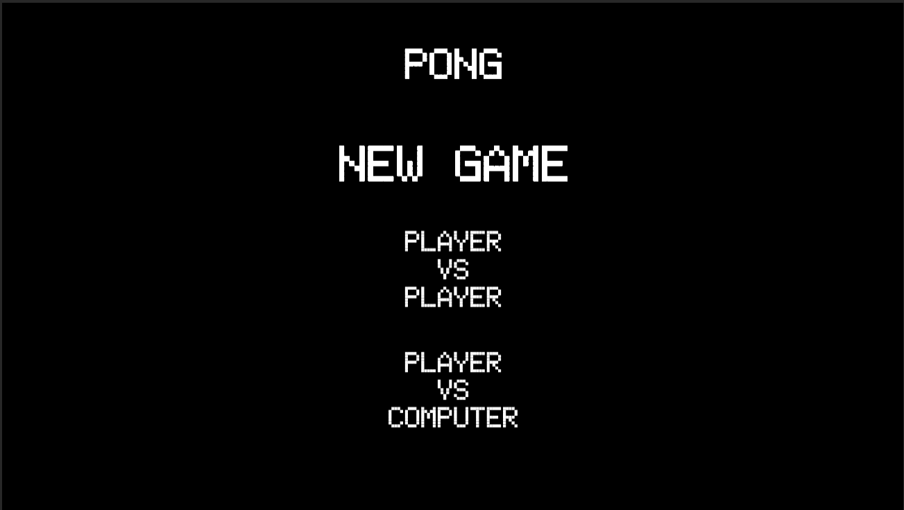
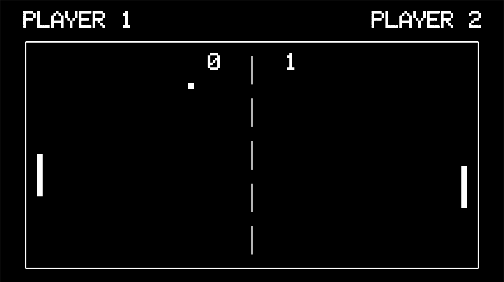
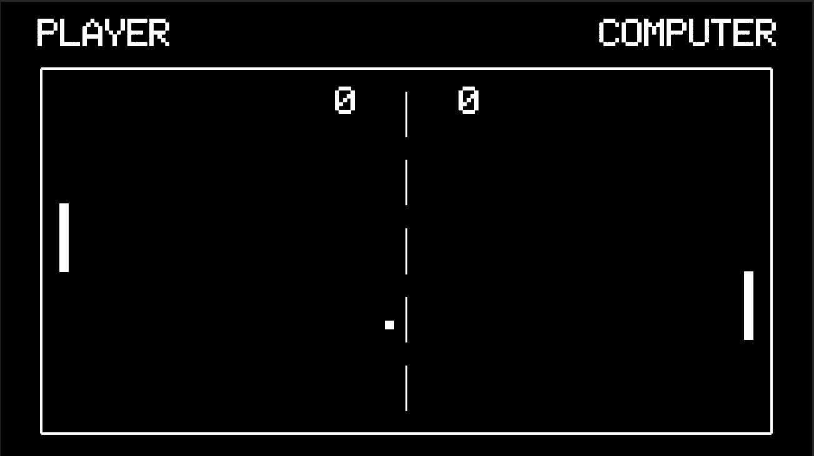

# Pong

### [Play it here!](https://sharemygame.com/@Quasar_/pong)

 |  | 

Classic and easy to create Pong. Created is with the 2 mods: player vs player and vs computer with simple AI. Mostly focused on understanding how to work with TMPro UI elements and new Unity Input sysytem.
